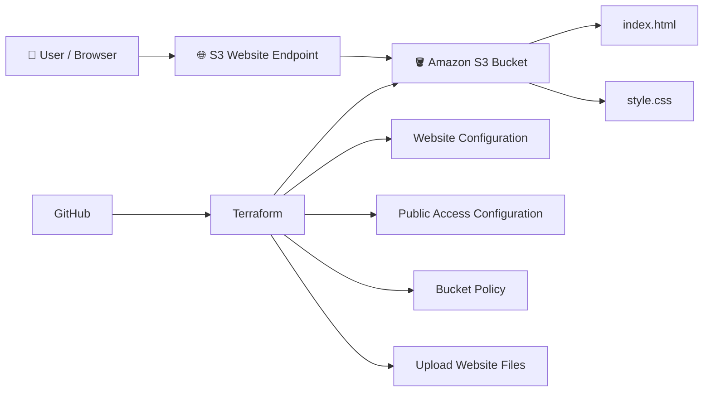

☁️ AWS S3 Static Website Deployment with Terraform

  <strong>Automated Static Website Hosting on AWS using Infrastructure as Code</strong>

  <a href="http://rayyan-cloud-website-2026.s3-website.ap-south-1.amazonaws.com/">🌐 Live Demo</a>
  &nbsp;&nbsp;•&nbsp;&nbsp;
  <a href="https://github.com/Rayyan87000/aws-s3-terraform-website">💻 GitHub</a>

  
  
  
  
  

🚀 Project Overview
This project demonstrates how to deploy a static HTML/CSS website to Amazon S3 and manage the complete infrastructure using Terraform.
Instead of manually configuring the AWS Console every time, the required infrastructure is written as code. Terraform can then create, configure, update, and remove the resources in a repeatable way.
✨ What this project does
Feature	Description
🪣 S3 Bucket	Hosts the static website
🌐 Static Hosting	Configures S3 website hosting with index.html
🔐 Bucket Policy	Allows public read access for website objects
📤 File Upload	Terraform uploads HTML and CSS files
⚙️ Infrastructure as Code	AWS infrastructure is managed through Terraform
🔢 Variables	Region and bucket name are configurable
📤 Outputs	Terraform generates the website endpoint
🌱 Version Control	Project is maintained using Git and GitHub

🌐 Live Demo
👉 Open the Live Website
AWS Region: ap-south-1 — Mumbai
The website is served directly from an Amazon S3 static website endpoint.
⚠️ Note: The S3 website endpoint used in this project is HTTP. For a production application, a common improvement would be to place CloudFront in front of S3 to provide HTTPS and keep the S3 bucket private.

🏗️ Architecture
The architecture below is intentionally kept simple because it represents the actual deployment used in this project.

Simple Request Flow
User
  ↓
S3 Website Endpoint
  ↓
Amazon S3 Bucket
  ↓
index.html
  ↓
style.css
  ↓
Website displayed in browser
Terraform is responsible for defining and managing the AWS infrastructure instead of manually configuring every setting through the AWS Console.
🧠 How the Project Works
The project has two main parts.
1️⃣ Website
The frontend is a simple static website built with:
- HTML — website structure
- CSS — website styling
Files:
website/
├── index.html
└── style.css
2️⃣ Infrastructure
Terraform manages the AWS resources required to host the website.
Terraform
   ↓
AWS Provider
   ↓
S3 Bucket
   ↓
Website Configuration
   ↓
Bucket Policy
   ↓
Website Files Uploaded
   ↓
Live Website
⚙️ Terraform Configuration Explained
The Terraform configuration is separated into small files so that each part has a clear responsibility.
📄 main.tf
main.tf contains the main AWS infrastructure.
It defines:
- AWS provider
- S3 bucket
- Public access configuration
- Static website configuration
- Bucket policy
- Website file uploads
AWS Provider
provider "aws" {
  region = var.aws_region
}
The AWS region is taken from the Terraform variable:
var.aws_region
This avoids hardcoding the region directly into the provider configuration.
🪣 S3 Bucket
resource "aws_s3_bucket" "website" {
  bucket = var.bucket_name
}
This tells Terraform to manage the S3 bucket used for the website.
The bucket name comes from:
terraform.tfvars
Example:
bucket_name = "rayyan-cloud-website-2026"
🔓 Public Access Configuration
resource "aws_s3_bucket_public_access_block" "website" {
  bucket = aws_s3_bucket.website.id

  block_public_acls       = false
  block_public_policy     = false
  ignore_public_acls      = false
  restrict_public_buckets = false
}
These settings are used because this learning project serves the website directly through the public S3 website endpoint.
🔐 Security note: Public S3 access should be used carefully. For production workloads, a private S3 bucket behind CloudFront is a stronger architecture.

🌍 Static Website Configuration
resource "aws_s3_bucket_website_configuration" "website" {
  bucket = aws_s3_bucket.website.id

  index_document {
    suffix = "index.html"
  }
}
This tells Amazon S3 to use:
index.html
as the default page when a visitor opens the website.
📜 Bucket Policy
The bucket policy allows visitors to read the website objects.
resource "aws_s3_bucket_policy" "website" {
  bucket = aws_s3_bucket.website.id

  policy = jsonencode({
    Version = "2012-10-17"

    Statement = [
      {
        Sid       = "PublicReadGetObject"
        Effect    = "Allow"
        Principal = "*"

        Action = "s3:GetObject"

        Resource = "${aws_s3_bucket.website.arn}/*"
      }
    ]
  })
}
The important permission is:
s3:GetObject
It allows a visitor's browser to retrieve objects such as:
index.html
style.css
📤 Uploading Website Files
Terraform also manages the website files stored inside S3.
HTML
resource "aws_s3_object" "index" {
  bucket       = aws_s3_bucket.website.id
  key          = "index.html"
  source       = "${path.module}/website/index.html"
  content_type = "text/html"
}
CSS
resource "aws_s3_object" "css" {
  bucket       = aws_s3_bucket.website.id
  key          = "style.css"
  source       = "${path.module}/website/style.css"
  content_type = "text/css"
}
So Terraform is doing more than creating the infrastructure — it also uploads the website content.
🔢 Terraform Variables
variables.tf
The project uses variables instead of hardcoding configuration.
variable "aws_region" {
  description = "AWS region where the website will be deployed"
  type        = string
  default     = "ap-south-1"
}

variable "bucket_name" {
  description = "Name of the S3 bucket"
  type        = string
}
This makes the Terraform configuration reusable.
For example, another user can deploy the same project with a different bucket name without changing main.tf.
📤 Terraform Output
outputs.tf
The project generates the website endpoint automatically.
output "website_endpoint" {
  description = "S3 static website endpoint"
  value = "http://${aws_s3_bucket.website.bucket}.s3-website.${var.aws_region}.amazonaws.com"
}
After:
terraform apply
Terraform displays the endpoint:
website_endpoint = "http://rayyan-cloud-website-2026.s3-website.ap-south-1.amazonaws.com"
This makes it easy to find the deployed website after deployment.
📁 Project Structure
aws-s3-terraform-website/
│
├── 📁 website/
│   ├── index.html
│   └── style.css
│
├── main.tf
├── variables.tf
├── outputs.tf
├── terraform.tfvars
├── .gitignore
├── .terraform.lock.hcl
└── README.md
File / Folder	Purpose
website/index.html	Main website page
website/style.css	Website styling
main.tf	AWS infrastructure
variables.tf	Terraform variables
terraform.tfvars	Environment-specific values
outputs.tf	Deployment outputs
.gitignore	Prevents local Terraform files/config from being committed
.terraform.lock.hcl	Locks provider dependency versions
README.md	Project documentation

💻 Run This Project on Another Computer
The project is designed so another developer can clone the repository and deploy the infrastructure from their own machine.
Prerequisites
Install:
- Terraform
- AWS CLI
- Git
- An AWS account with the required permissions
1️⃣ Configure AWS CLI
Run:
aws configure
Enter your AWS credentials and region:
AWS Access Key ID
AWS Secret Access Key
Default region: ap-south-1
Output format: json
Verify the credentials:
aws sts get-caller-identity
🔐 Never upload AWS access keys or secret keys to GitHub.

2️⃣ Clone the Repository
git clone https://github.com/Rayyan87000/aws-s3-terraform-website.git
Enter the project:
cd aws-s3-terraform-website
3️⃣ Create terraform.tfvars
terraform.tfvars is intentionally excluded from Git because it contains environment-specific configuration.
Create:
terraform.tfvars
Add:
aws_region  = "ap-south-1"
bucket_name = "your-unique-bucket-name"
⚠️ Important
S3 bucket names must be globally unique.
Example:
bucket_name = "my-static-website-2026-12345"
4️⃣ Initialize Terraform
terraform init
Terraform downloads the required AWS provider and prepares the working directory.
5️⃣ Validate the Configuration
terraform validate
Expected result:
Success! The configuration is valid.
6️⃣ Review the Deployment
Before creating anything, run:
terraform plan
This lets you review what Terraform intends to create or change.
7️⃣ Deploy
Run:
terraform apply
Terraform will ask for confirmation.
Type:
yes
The deployment flow is:
Create S3 Bucket
      ↓
Configure Public Access
      ↓
Configure Website Hosting
      ↓
Create Bucket Policy
      ↓
Upload index.html
      ↓
Upload style.css
      ↓
Generate Website Endpoint
8️⃣ Open the Website
After deployment, Terraform prints:
website_endpoint = ...
Open that endpoint in your browser.
🎉 Your website is now deployed.
🔄 Updating the Website
Modify:
website/index.html
or:
website/style.css
Then run:
terraform apply
Terraform compares the desired configuration with the existing infrastructure and updates the required resources/files.
This is one of the main benefits of Infrastructure as Code.
🧹 Destroy the Infrastructure
When you no longer need the deployment:
terraform destroy
Terraform will show the resources that are going to be removed.
Type:
yes
⚠️ Warning: terraform destroy is destructive. Do not run it against infrastructure you want to keep.

🛡️ Security Considerations
This project intentionally uses public S3 website access because it demonstrates the classic S3 static website architecture.
For a production application, a stronger architecture would be:
User
  ↓
HTTPS
  ↓
CloudFront
  ↓
Private S3 Bucket
This approach can provide:
- 🔒 HTTPS
- 🌍 Global content delivery
- 🚫 Private S3 bucket
- ⚡ Better caching and performance
- 🛡️ Reduced direct exposure of the S3 bucket
🎯 What I Practiced
Through this project, I worked with:
- ☁️ Amazon S3
- ⚙️ Terraform
- 🏗️ Infrastructure as Code
- 🔐 S3 bucket policies
- 🌐 Static website hosting
- 📦 Terraform resources
- 🔢 Terraform variables
- 📤 Terraform outputs
- 🖥️ AWS CLI
- 🔄 Terraform plan / apply / destroy
- 🌱 Git
- 💻 GitHub
- 🔒 Basic AWS security concepts
💡 Why Terraform Instead of Manual AWS Setup?
❌ Manual approach
AWS Console
    ↓
Create S3 Bucket
    ↓
Configure Settings
    ↓
Configure Website Hosting
    ↓
Configure Permissions
    ↓
Create Policy
    ↓
Upload Files
    ↓
Repeat Manually
✅ Terraform approach
Terraform Code
      ↓
terraform plan
      ↓
terraform apply
      ↓
AWS Infrastructure
      ↓
Live Website
Terraform makes the infrastructure:
Repeatable • Version Controlled • Reproducible • Easier to Maintain
🧩 Tech Stack
Technology	Purpose
☁️ Amazon S3	Static website hosting
⚙️ Terraform	Infrastructure as Code
🖥️ AWS CLI	AWS authentication and management
🌐 HTML5	Website structure
🎨 CSS3	Website styling
🌱 Git	Version control
💻 GitHub	Source code hosting

🔗 Project Links

🌐 Live Website
💻 GitHub Repository

👨‍💻 Author
Rayyan Kaif Ansari
Computer Science & Engineering Graduate
Cloud / DevOps Enthusiast

  ⭐ <strong>If you found this project useful, feel free to explore the repository.</strong>

  Built with ☁️ AWS + ⚙️ Terraform + 💻 GitHub

