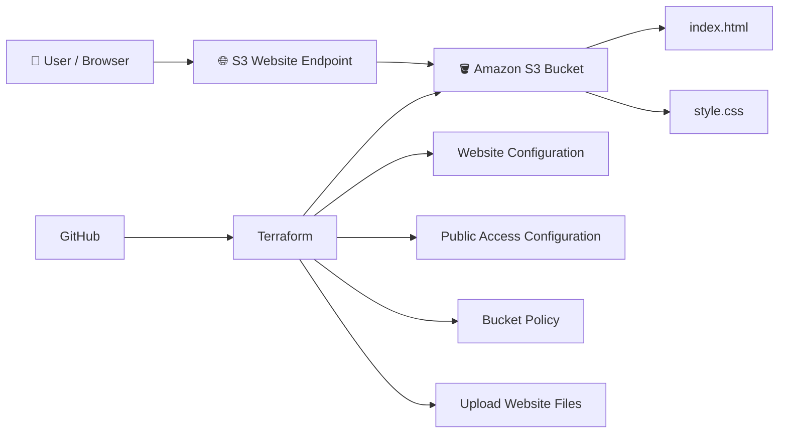

☁️ AWS S3 Static Website Deployment with Terraform

  <strong>Automated Static Website Hosting on AWS using Terraform (Infrastructure as Code)</strong>

  <a href="http://rayyan-cloud-website-2026.s3-website.ap-south-1.amazonaws.com/">🌐 Live Demo</a>
  •
  <a href="https://github.com/Rayyan87000/aws-s3-terraform-website">💻 GitHub Repository</a>

📌 About the Project
This project demonstrates how to deploy a static HTML/CSS website to Amazon S3 and manage the AWS infrastructure using Terraform.
The project started with a simple static website and was then converted into an Infrastructure as Code (IaC) deployment. Instead of manually configuring the S3 bucket every time, Terraform defines the required AWS resources and configuration in code.
What this project does
- Creates/manages an Amazon S3 bucket
- Configures the bucket for static website hosting
- Configures public access settings required for this learning deployment
- Creates a bucket policy for public website content
- Uploads index.html and style.css automatically
- Generates the website endpoint as a Terraform output
- Keeps infrastructure configuration version-controlled in Git/GitHub
AWS's S3 documentation describes static website hosting as configuring a bucket for website hosting, setting an index document, permissions, and uploading the website content. citeturn0search1turn0search8
🌐 Live Website
👉 Open the Live Website
AWS Region: ap-south-1 (Mumbai)
The website is served directly through the Amazon S3 static website endpoint.
⚠️ Note: S3 static website endpoints are HTTP endpoints. For a production website, AWS recommends a more secure architecture using CloudFront, which can provide HTTPS and keep S3 public access disabled. citeturn0search4turn0search8

🏗️ Architecture

Simple request flow
User
  ↓
S3 Website Endpoint
  ↓
Amazon S3 Bucket
  ↓
index.html
  ↓
style.css
  ↓
Website displayed in browser
Terraform is used to define and manage the AWS infrastructure instead of manually configuring every setting through the AWS Console.
🧠 How the Project Works
The project has two main parts:
1️⃣ Website
The actual frontend is a simple static website made using:
- HTML
- CSS
The files are located inside:
website/
├── index.html
└── style.css
2️⃣ Infrastructure
Terraform manages the AWS resources required to host the website.
Terraform
   ↓
AWS Provider
   ↓
S3 Bucket
   ↓
Website Configuration
   ↓
Bucket Policy
   ↓
Website Files Uploaded
   ↓
Live Website
⚙️ How the Terraform Code Works
The Terraform configuration is divided into small files so that the project is easier to understand and maintain.
main.tf
This is the main infrastructure file.
It defines:
- AWS provider
- S3 bucket
- Public access configuration
- Static website configuration
- Bucket policy
- Website file uploads
AWS Provider
provider "aws" {
  region = var.aws_region
}
Instead of hardcoding the region, Terraform gets it from the variable:
var.aws_region
🪣 S3 Bucket
resource "aws_s3_bucket" "website" {
  bucket = var.bucket_name
}
This tells Terraform to manage the S3 bucket used for the website.
The bucket name comes from:
terraform.tfvars
For example:
bucket_name = "rayyan-cloud-website-2026"
🔓 Public Access Configuration
resource "aws_s3_bucket_public_access_block" "website" {
  bucket = aws_s3_bucket.website.id

  block_public_acls       = false
  block_public_policy     = false
  ignore_public_acls      = false
  restrict_public_buckets = false
}
For this learning project, these settings allow the S3 website content to be publicly accessible.
This is required for the architecture used here because the S3 website endpoint serves publicly accessible website objects.
🔐 For production workloads, avoid making S3 content publicly accessible when possible. A CloudFront distribution with Origin Access Control is a better secure architecture. citeturn0search8

🌍 Static Website Configuration
resource "aws_s3_bucket_website_configuration" "website" {
  bucket = aws_s3_bucket.website.id

  index_document {
    suffix = "index.html"
  }
}
This tells S3:
"When someone opens the website, use index.html as the default page."

Terraform's AWS provider recommends using the separate aws_s3_bucket_website_configuration resource for managing S3 website configuration. citeturn0search0
📜 Bucket Policy
resource "aws_s3_bucket_policy" "website" {
  bucket = aws_s3_bucket.website.id

  policy = jsonencode({
    Version = "2012-10-17"

    Statement = [
      {
        Sid       = "PublicReadGetObject"
        Effect    = "Allow"
        Principal = "*"

        Action = "s3:GetObject"

        Resource = "${aws_s3_bucket.website.arn}/*"
      }
    ]
  })
}
This policy allows users to read the website objects from the S3 bucket.
The important part is:
s3:GetObject
It means a visitor can retrieve objects such as:
index.html
style.css
📤 Uploading Website Files
Terraform also uploads the website files.
HTML
resource "aws_s3_object" "index" {
  bucket       = aws_s3_bucket.website.id
  key          = "index.html"
  source       = "${path.module}/website/index.html"
  content_type = "text/html"
}
CSS
resource "aws_s3_object" "css" {
  bucket       = aws_s3_bucket.website.id
  key          = "style.css"
  source       = "${path.module}/website/style.css"
  content_type = "text/css"
}
So Terraform does not only create the infrastructure — it also uploads the website files.
The AWS Terraform provider supports aws_s3_object for uploading files into an S3 bucket. citeturn0search6
🔢 Variables
The project uses variables instead of hardcoding configuration.
variables.tf
variable "aws_region" {
  description = "AWS region where the website will be deployed"
  type        = string
  default     = "ap-south-1"
}

variable "bucket_name" {
  description = "Name of the S3 bucket"
  type        = string
}
This makes the Terraform configuration reusable.
For example, another user can provide a different bucket name without changing main.tf.
📤 Terraform Output
The project also generates the website URL automatically.
outputs.tf
output "website_endpoint" {
  description = "S3 static website endpoint"
  value = "http://${aws_s3_bucket.website.bucket}.s3-website.${var.aws_region}.amazonaws.com"
}
After:
terraform apply
Terraform displays:
website_endpoint = "http://rayyan-cloud-website-2026.s3-website.ap-south-1.amazonaws.com"
This makes it easy to find the deployed website after deployment.
📁 Project Structure
aws-s3-terraform-website/
│
├── website/
│   ├── index.html
│   └── style.css
│
├── main.tf
├── variables.tf
├── outputs.tf
├── terraform.tfvars
├── .gitignore
├── .terraform.lock.hcl
└── README.md
File purpose
File / Folder	Purpose
website/index.html	Main website page
website/style.css	Website styling
main.tf	AWS infrastructure
variables.tf	Terraform variables
terraform.tfvars	Environment-specific values
outputs.tf	Deployment outputs
.gitignore	Prevents Terraform state/config files from being committed
.terraform.lock.hcl	Locks Terraform provider versions
README.md	Project documentation

🚀 Run This Project on Another Computer
You can clone this project on another computer and deploy it from there.
1. Install Terraform
Install Terraform on the new computer.
Verify:
terraform version
2. Install and Configure AWS CLI
Install the AWS CLI and configure credentials:
aws configure
Enter:
AWS Access Key ID
AWS Secret Access Key
Default region: ap-south-1
Output format: json
Verify the AWS identity:
aws sts get-caller-identity
🔐 Never put AWS access keys or secret keys inside GitHub, Terraform files, or the README.

3. Clone the Repository
git clone https://github.com/Rayyan87000/aws-s3-terraform-website.git
Move into the project:
cd aws-s3-terraform-website
4. Create terraform.tfvars
terraform.tfvars is intentionally excluded from Git because it contains environment-specific configuration.
Create:
terraform.tfvars
Add:
aws_region  = "ap-south-1"
bucket_name = "your-unique-bucket-name"
Important
S3 bucket names must be globally unique.
For example:
bucket_name = "my-static-website-2026-12345"
5. Initialize Terraform
terraform init
Terraform downloads the required AWS provider and prepares the project.
6. Validate the Configuration
terraform validate
Expected result:
Success! The configuration is valid.
7. Review the Infrastructure
terraform plan
This shows what Terraform is going to create or change before anything is deployed.
8. Deploy the Website
terraform apply
Terraform will ask for confirmation.
Type:
yes
Terraform will then:
Create S3 bucket
       ↓
Configure public access settings
       ↓
Configure static website hosting
       ↓
Create bucket policy
       ↓
Upload index.html
       ↓
Upload style.css
       ↓
Generate website endpoint
9. Open the Website
After deployment, Terraform prints:
website_endpoint = ...
Open that URL in your browser.
🔄 Updating the Website
If you change:
website/index.html
or:
website/style.css
run:
terraform apply
Terraform compares the desired configuration with the current infrastructure and updates the required S3 objects.
This is one of the main benefits of using Infrastructure as Code.
🧹 Destroy the Infrastructure
When you no longer need the deployment:
terraform destroy
Terraform will show the resources that are going to be removed.
Type:
yes
⚠️ terraform destroy is destructive. Do not run it against infrastructure you want to keep.

🛡️ Security Notes
This project intentionally uses public S3 website access because it demonstrates the classic S3 static website architecture.
However, this should not automatically be copied to production.
AWS recommends keeping S3 Block Public Access enabled whenever possible. For a secure production static website, a common architecture is:
User
  ↓
HTTPS
  ↓
CloudFront
  ↓
S3 Bucket
CloudFront can provide HTTPS while allowing the S3 bucket to remain private using Origin Access Control. citeturn0search8turn0search13
🎯 What I Learned From This Project
This project helped me practice:
- ☁️ Amazon S3
- 🏗️ Infrastructure as Code
- ⚙️ Terraform
- 🔐 AWS bucket policies
- 🌐 Static website hosting
- 📦 Terraform resources
- 🔢 Terraform variables
- 📤 Terraform outputs
- 🖥️ AWS CLI
- 🔄 Terraform plan/apply/destroy workflow
- 🌱 Git and GitHub
- 🔒 Basic AWS security concepts
💡 Why Terraform Instead of Manual AWS Console Setup?
Without Terraform:
Open AWS Console
     ↓
Create S3 bucket
     ↓
Configure settings
     ↓
Configure website hosting
     ↓
Configure permissions
     ↓
Create policy
     ↓
Upload files
     ↓
Repeat manually next time
With Terraform:
Write Infrastructure Code
          ↓
     terraform plan
          ↓
     terraform apply
          ↓
      AWS Resources
          ↓
     Live Website
The Terraform approach makes the infrastructure repeatable, version-controlled, and easier to reproduce.
🧩 Technologies Used
Technology	Usage
Amazon S3	Static website hosting
Terraform	Infrastructure as Code
AWS CLI	AWS authentication and management
HTML	Website structure
CSS	Website styling
Git	Version control
GitHub	Source code hosting

🔗 Project Links
🌐 Live Website:
http://rayyan-cloud-website-2026.s3-website.ap-south-1.amazonaws.com/
💻 GitHub:
https://github.com/Rayyan87000/aws-s3-terraform-website
👨‍💻 Author
Rayyan Kaif Ansari
Computer Science & Engineering
Cloud / DevOps Enthusiast
⭐ If you found this project useful
Feel free to explore the repository and use the architecture as a starting point for learning AWS + Terraform.
📚 References
- Amazon S3 Static Website Hosting: https://docs.aws.amazon.com/AmazonS3/latest/userguide/WebsiteHosting.html
- Amazon S3 Website Hosting Tutorial: https://docs.aws.amazon.com/AmazonS3/latest/userguide/HostingWebsiteOnS3Setup.html
- Terraform AWS Provider – S3 Bucket: https://registry.terraform.io/providers/hashicorp/aws/latest/docs/resources/s3_bucket
- Terraform AWS Provider – S3 Object: https://registry.terraform.io/providers/hashicorp/aws/latest/docs/resources/s3_object